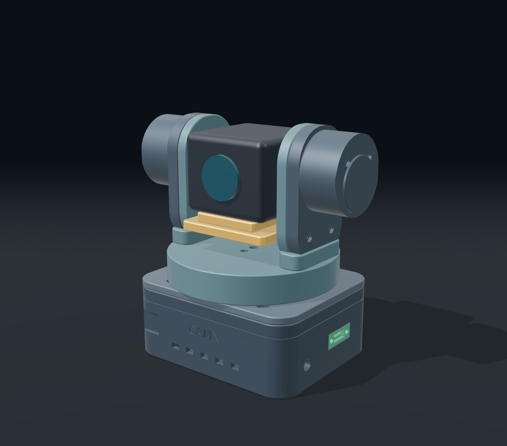
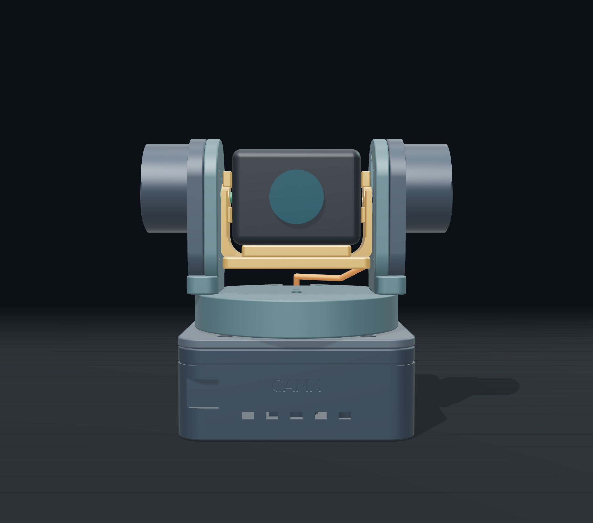
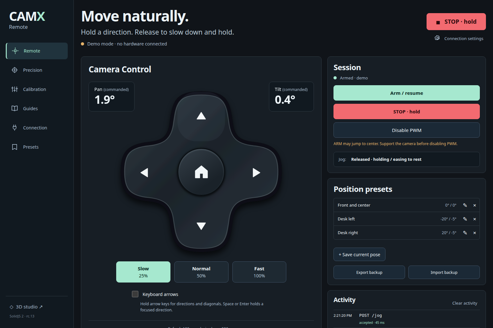
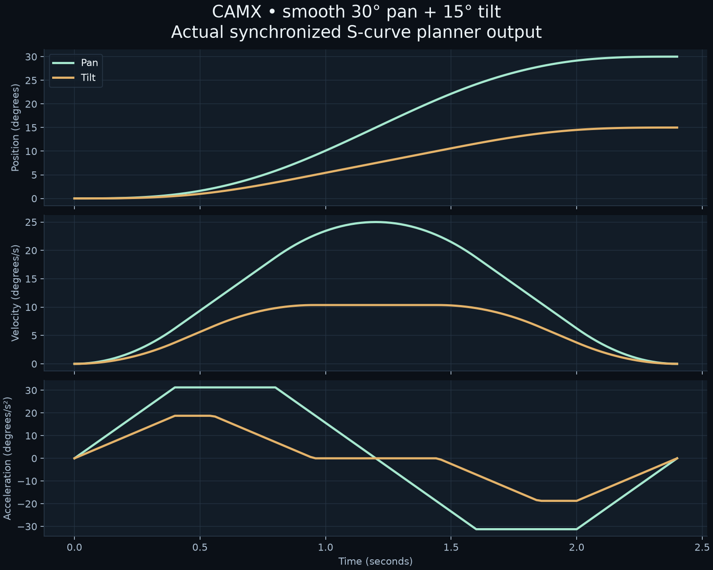

<div align="center">

# 📷 CAMX

### Your webcam just unlocked movement. ✨

**ESP32 brains. Two tiny servos. One printable pan & tilt rig.**

[](https://github.com/worxbend/camx/actions/workflows/release.yml)
[](https://worxbend.github.io/camx/)
[](firmware/platformio.ini)
[](cad/model.py)
[](docs/assembly.md)

[**🎛️ Try the control desk**](https://worxbend.github.io/camx/control/?demo=1) · [**🌀 Open the 3D studio**](https://worxbend.github.io/camx/) · [**📦 Get the downloads**](https://github.com/worxbend/camx/releases/latest) · [**🛠️ Build guide**](docs/assembly.md)



</div>

---

## ✨ The vision

Take an Anker PowerConf webcam. Give it a smooth pan axis, a balanced tilt cradle, and a rounded enclosure that actually looks like a device you'd keep on your desk.

The compact version uses a **100 × 82 × 38 mm base**, a **Ø92 mm pan platform** and shallow lower side shells. The complete neutral assembly is **126.6 × 91.5 × 127 mm**, including the two pivot housings. Camera fit targets the owner-stated **50 mm-wide camera**, represented by a **50 × 51 × 41 mm envelope**; verify your exact PowerConf model and folded clip.

CAMX follows the owner's hand-drawn concept: **a curved camera cradle and an ESP32 beside the pan servo in the base**, rebuilt to match your revised sketch with **matching rounded arm housings, mirrored pivot caps, a circular pan platform and a U-shaped support**. The passive housing has the same outer shape as the servo side, with bearing hardware inside. Integral standoffs let both outer covers attach with short M2 × 8 mm screws. The camera bolts on through its existing **1/4″-20 tripod thread**. The tilt-servo lead has a rear shell exit, arm tie eyes, a pan-platform notch and a separate rear base entry. An orange neutral-pose guide shows its route in the viewer; leave an external service loop for pan. The USB-C panel board and **1000 µF capacitor** get dedicated space inside. The visible USB-C metal flange fits a recessed pocket in the right wall, 0.2 mm below its outer surface, with reinforced backing and internal nuts.

> 🧪 **Prototype, with receipts.** The firmware compiles and **615 CAD/mesh/clearance checks pass**. Hardware dimensions are still provisional; physical fit and load testing are the next step. Print the fit coupon first.

**Readiness:** ready for controlled prototype commissioning after fit/power checks. Physical validation remains pending, and the Python CAD/image toolchain has an unresolved Pillow dependency constraint and 13 security alerts. Firmware/browser production audits have no known findings. [Final audit and limitations →](docs/design/remote-qa.md)

## 🌀 Spin it before you print it

[**Launch the live viewer →**](https://worxbend.github.io/camx/)

Drag to orbit. Scroll to zoom. Preview **±60° pan** and **±25° tilt**, pull the assembly apart with the explode slider, toggle hardware or wireframe, and hide individual parts. It works on desktop and phone.



The viewer loads the **actual CAD GLB**. The webcam, PCB, servos and capacitor are simplified hardware envelopes. This site previews the design; it does not send commands to your motors.

## 📦 Pick your download

| You want… | Grab this |
| --- | --- |
| The whole project, source included | [`camx-project.zip`](https://github.com/worxbend/camx/releases/latest/download/camx-project.zip) |
| Straight to the slicer | [`camx-print-parts.zip`](https://github.com/worxbend/camx/releases/latest/download/camx-print-parts.zip) |
| ESP32 source + binaries + LittleFS client | [`camx-firmware.zip`](https://github.com/worxbend/camx/releases/latest/download/camx-firmware.zip) |
| A website you can host yourself | [`camx-viewer.zip`](https://github.com/worxbend/camx/releases/latest/download/camx-viewer.zip) |
| SolidJS control app + local bridge | [`camx-control.zip`](https://github.com/worxbend/camx/releases/latest/download/camx-control.zip) |
| File integrity checks | [`checksums.sha256`](https://github.com/worxbend/camx/releases/latest/download/checksums.sha256) |

Tagged releases publish these files automatically. Between releases, download the **camx-release-files** artifact from a successful [Build & release run](https://github.com/worxbend/camx/actions/workflows/release.yml). Artifacts are retained for 30 days; releases are the durable download location. The committed [full project bundle](exports/camx-files.zip) is also available.

**Formats on deck:** STL · 3MF · STEP · BREP · OBJ · PLY · OFF · GLB · glTF · SVG · DXF · PNG · JPEG · WebP · TIFF.

## 🧩 What's inside

| Part of the project | What it does |
| --- | --- |
| [🎛️ Firmware](firmware/) | 50 Hz servo PWM, synchronized jerk-limited S-curves, Wi-Fi controls, serial commands, saved calibration and latched STOP |
| [📐 Parametric CAD](cad/) | Thirteen printable parts, stock servo horn interfaces, adjustable component dimensions |
| [🌀 3D studio](viewer/) | Orbit, pan/tilt previews, explode, wireframe, part visibility and downloads |
| [🛠️ Assembly guide](docs/assembly.md) | Wiring, fasteners, print orientation, balance and first startup |
| [✅ Validation](exports/validation.json) | CAD solids, watertight STL/3MF meshes and sampled clearance checks |
| [🎛️ Control client](client/) | SolidJS 2 hold-to-move remote, presets, calibration, guides and local bridge |
| [🚀 GitHub Actions](.github/workflows/) | Firmware/CAD rebuilds, viewer tests, release downloads and Pages deployment |

### 🖨️ Thirteen printed pieces. Zero printed spline teeth.

`drive_arm` · `base` · `lid` · `pan_arm` · `camera_cradle` · `tilt_cover` · `bearing_retainer` · `spindle_keeper` · `tripod_nut_retainer` · `idler_cover` · `fit_coupon` · `idler_arm` · `idler_bearing_retainer`

Use your servos' original horns and center screws. A **6805 bearing (25 × 37 × 7 mm)** supports the pan platform. Steel hardware provides the camera screw and captive tripod nut.

## 🔌 The hardware lineup

- 📷 Anker PowerConf webcam — confirm the exact model, dimensions, mass and thread depth.
- 🎛️ ESP32-WROOM-32 DevKit — the photographed board has a USB-C programming port.
- ⚙️ **2 × positional SG90-type micro servos** — continuous-rotation models won't follow angles.
- 🔋 Regulated **5 V / 3 A PSU** and **1000 µF electrolytic**, rated at least 10 V.
- 🔗 Your panel USB-C module — verify its pinout, CC resistors and current rating.
- 🛞 One 6805 pan bearing and one 625 tilt bearing, fasteners, zip ties and a 1/4″-20 camera screw/nut.

**GPIO18 → pan · GPIO19 → tilt · GPIO33 → optional STOP button.** Common ground for everything. Camera USB stays connected directly to the PC. Servo power comes from the PSU, not the ESP32's 3V3 rail.

[**Read the wiring and source-isolation notes before powering up →**](docs/assembly.md#wiring)

## ⚡ First boot

1. Measure your components and update [`cad/parameters.json`](cad/parameters.json).
2. Print the **fit coupon**, then dry-fit the empty mechanism.
3. Keep servos disconnected during flashing. Follow the guide when using USB and external power.
4. Copy [`credentials.example.h`](firmware/include/credentials.example.h) to `firmware/include/credentials.h` (gitignored), set your Wi-Fi credentials and API token, rebuild and flash. Open the IP printed by the serial monitor after connection.
5. Center the servos with their horns removed, assemble, balance the camera, and expand travel carefully.

**PWM starts disabled.** STOP holds the current commanded position; DISARM releases torque. Support the camera before disabling PWM. Servo angles are commanded estimates, not encoder measurements. Automatic face tracking would require a separate host application; it is not included in this firmware.

## 🎮 A real remote. In your browser.

The **SolidJS 2** client gives CAMX a real operator interface: a sculpted press-and-hold directional pad, diagonal multi-touch, optional held keyboard arrows, three speed levels, editable presets, JSON backups, live status and a bounded activity log. A dedicated calibration workspace includes pulse settings, inversion, speed, measured travel limits, and a four-step walkthrough. Wiring, assembly and Wi-Fi guides are built in.



**Hold to move. Release to brake smoothly.** A normalized velocity pair is refreshed every 100 ms. Firmware stops and latches if the jog lease is not renewed within 500 ms. Pointer cancellation, hidden tabs and connection loss clear held inputs; returning never resumes them. The Precision tab retains combined angle targets, sliders and fine nudges. [Why this protocol? →](docs/jog-design.md)

**STOP stays visible.** Connecting never arms the servos. Calibration saves only with PWM disabled. The optional control lease starts off; losing the connection cancels queued motion and reconnection requires deliberate ARM. Tokens remain in memory and stay out of backups and browser storage.

[**Explore the safe demo →**](https://worxbend.github.io/camx/control/?demo=1) · [**Install on your ESP32 →**](docs/control-client.md) · [**Download the client →**](https://github.com/worxbend/camx/releases/latest/download/camx-control.zip)

The Pages version is a simulation. For real control, serve the client directly from the ESP32's **LittleFS** partition at `http://DEVICE_IP/control/`, or run the included **localhost LAN bridge**. No cloud account or Internet connection is needed after installation. Webcam video and face tracking are separate host-side concerns.

SolidJS 2 is pinned to **2.0.0-rc.13**, with matching web runtime/compiler packages. It is a release candidate; dependencies and the lockfile are committed. Node 24 is recommended. [Official Solid releases](https://github.com/solidjs/solid/releases).

```sh
npm --prefix client ci
npm --prefix client run build
npm --prefix client run stage:firmware
.venv/bin/pio run -d firmware -t buildfs
# Upload configured firmware + filesystem after reviewing wiring/power isolation.
.venv/bin/pio run -d firmware -t upload
.venv/bin/pio run -d firmware -t uploadfs
```

For a desktop control station:

```sh
CAMX_DEVICE_URL=http://DEVICE_IP npm --prefix client run serve
# Open http://127.0.0.1:4175/control/
```

## 🛝 Smooth moves, built into firmware

Each accepted pan/tilt target uses a synchronized **jerk-limited S-curve**: gentle start, gradual acceleration, bounded top speed, then gradual deceleration to zero velocity and acceleration. The existing calibration **Speed** is the maximum speed, not a constant-rate jump. At the default settings, a 30° pan move from rest takes about **2.4 seconds**. Short moves reach a lower peak speed automatically.

New targets preserve the current commanded position, velocity and acceleration. Repeating the same target does not restart the ramp. The complete calculated path must stay within saved limits, including braking before a reversal. **STOP, Wi-Fi loss, watchdog expiry and DISARM remain immediate**; emergency stops do not wait for easing. Normal remote release brakes smoothly; emergency STOP holds immediately. For an absolute move longer than five seconds, explicitly enable the client's Maintain control lease or send accepted heartbeat/commands.



The offline planner uses the vendored MIT-licensed [Ruckig 0.15.3 core](firmware/lib/ruckig/UPSTREAM.md). SG90 backlash, deadband, pulse resolution and camera balance still affect physical smoothness; there is no encoder feedback. Physical motion has not yet been verified.

## 📡 LAN control

The ESP32 joins your **2.4 GHz Wi-Fi** and serves HTTP on port 80. Send both center-relative offsets in one request; repeats do not accumulate movement. [API and hardening details →](docs/firmware-api.md)

```sh
curl -X POST http://DEVICE_IP/arm -H 'X-CAMX-Request: 1' -H "Authorization: Bearer $CAMX_TOKEN"
curl http://DEVICE_IP/move -H 'X-CAMX-Request: 1' -H "Authorization: Bearer $CAMX_TOKEN" \
  -H 'Content-Type: application/json' -d '{"pan":15,"tilt":-5}'
```

Public downloads contain **unconfigured firmware**. Build locally with your ignored `credentials.h`; configured binaries also contain secrets and must stay private.

## 🧑‍💻 Build it yourself

```sh
# Python 3.12+ and a C++ compiler
python3 -m venv .venv
.venv/bin/pip install -r requirements.txt

# Control client + matching ESP32 filesystem
npm --prefix client ci
npm --prefix client run build
npm --prefix client run stage:firmware

# Firmware + CAD + print validation
.venv/bin/pio run -d firmware
.venv/bin/pio run -d firmware -t buildfs
.venv/bin/python cad/model.py
.venv/bin/python tests/validate_cad.py
.venv/bin/python tools/test_motion.py

# Diagrams + download bundle
.venv/bin/python tools/diagrams.py
.venv/bin/python tools/package.py

# Browser studio — Node 22.12+ or a supported newer version
cd viewer
npm ci
npm run build
npm run dev
```

The CAD source uses millimetres. STL/3MF files are oriented for printing and sit at Z=0. STEP/BREP preserve assembly coordinates. GLB/glTF use metres with Y up. Vector projections are visualization references; the [dimension sheet](exports/drawings/dimensions.svg) lists defaults to verify.

For browser QA and polished stills, install Chromium with `npx playwright install chromium`, serve the built viewer, then run `node scripts/qa.mjs` and `node scripts/render-cad.mjs` from `viewer/`. Set `CAMX_QA_URL` to your preview URL. Run `.venv/bin/python tools/image_formats.py` from the root to encode captured previews. Matplotlib is the default headless preview fallback.

## 🚀 Ship it with Actions

**Every push / PR:** build the SolidJS client and LittleFS image → compile ESP32 firmware → test motion, parser and LAN bridge → regenerate and check CAD → test desktop/mobile controls and viewer → upload downloadable artifacts.

**Every `v*` tag:** run the same checks, then create a GitHub Release with all five ZIPs and SHA-256 checksums.

```sh
git tag v0.5.1
git push origin v0.5.1
```

**GitHub Pages:** the separate [Pages workflow](.github/workflows/pages.yml) builds and publishes the live studio and control demo on main/master pushes. Configure **Settings → Pages → Source → GitHub Actions**. All site assets ship locally; repository subpaths such as `/camx/` work without changing the Vite base.

<details>
<summary><strong>🧪 What was checked — and what still needs real hardware</strong></summary>

- Firmware compilation, pure C++ motion tests and HTTP/JSON parser fuzzing with sanitizers.
- Control-client unit/browser tests and three local bridge checks, including paired movement, calibration, cancellation, reconnect and token privacy.
- Thirteen valid CAD solids; watertight, oriented STL/3MF exports with matching bounds.
- Sampled pan/tilt clearance; the exact count is recorded in the validation report.
- Browser loading, pivots, explosion, visibility, wireframe, view presets, reset, downloads and guide navigation.
- Desktop **1536 × 1024** and mobile **390 × 844**, including a `/camx/` deployment path.
- Archive integrity and generated-file checksums.

Still to verify: your component measurements, printer tolerances, actual servo travel, cable slack, load balance, heat, jitter and durability. The opposite 625 bearing reduces cantilever loading. Matching 6 mm side plates, rounded foot joints and a compact base support the symmetrical assembly. The SG90 still carries part of the load; physical durability remains unverified. See the [structural review](docs/structural-review.md). Published SG90 stall torque is not a continuous load rating.

[Workflow decisions](docs/workflow.md) · [Visual concept and review](docs/design/fidelity-review.md) · [Viewer QA](docs/design/viewer-qa.json) · [Remote QA](docs/design/remote-qa.md)

</details>

---

<div align="center">

**Sketch → CAD → print → move.** 🖤

Built with **build123d · PlatformIO · SolidJS 2 · Three.js** by **worxbend**.

</div>

🔩 **Printed bearing-side joint:** print the [shoulder axle](exports/fasteners/printed_idler_shoulder_axle.stl), [matching captive nut](exports/fasteners/printed_idler_captive_nut.stl), outer washer and inner spacer from the [kit ZIP](exports/fasteners/printed-idler-kit.zip). No metal screw or nut is needed in this joint. Keep the 625 bearing. PETG/nylon and a supported fit/load trial are recommended; printed strength and durability remain unverified. The cradle remains 57.2 mm wide with a 51 mm camera opening.

📶 **Automatic recovery:** transient control-request failures no longer require manually reconnecting. The client retries status indefinitely and restores controls when the ESP32 responds, while cancelling interrupted holds and retaining explicit ARM after a device STOP.

📶 **Firmware 0.5.2 connection holds:** transport timeouts cancel motion and retain holding torque without requiring re-ARM. Reconnect, then press a direction again. Explicit STOP, physical STOP and PWM disable still require deliberate ARM. Update both firmware and the client filesystem.
