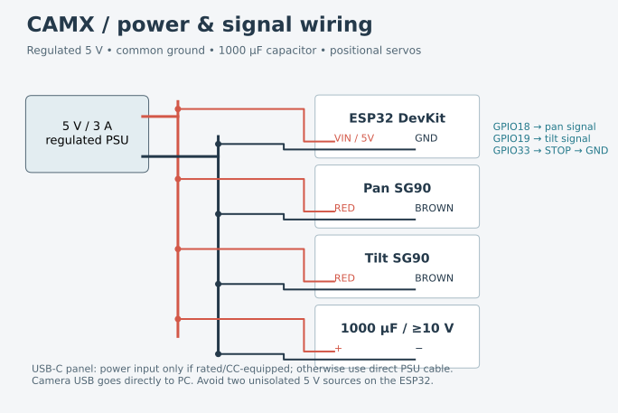

# CAMX assembly and commissioning

This is a buildable, dimension-adjustable prototype based on your sketches. It is not physically fit-tested. Use two **positional** SG90 servos; continuous-rotation versions cannot follow angles. The photos appear consistent with a square Anker camera, but do not establish its model or dimensions.

## Measurements before printing

Record webcam width/depth/height including the folded original mounting clip; its mass; tripod thread position and usable insertion depth; CG relative to the screw; cable bend radius. Default camera envelope is **55 × 55 × 50 mm**, **150 g**. The thread slot allows approximately ±8 mm fore/aft adjustment. Measure your particular SG90 body, ears, screw pitch, shaft height and stock horn. The pictured ESP32 has a USB-C port; verify its approximately 58 × 29 mm board fits the rails and left-front access opening. Measure USB flange, hole pitch, PCB overhang, capacitor diameter and height. Defaults are not measurements from photographs.

Edit `cad/parameters.json`, regenerate, and rerun checks. Fit clearance is per radial/side convention indicated in the source; some structural and fastener dimensions are fixed constants and require editing `cad/model.py` for substantially different hardware. The parts are not a universal automatic fit system.

## Bill of materials

| Item | Quantity | Notes |
| --- | ---: | --- |
| ESP32-WROOM-32 DevKit | 1 | Pictured USB-C version; 5 V input verified on actual board |
| Positional SG90-type servo | 2 | Stock spline-matching horns and center screws |
| 6805 bearing | 1 | 25 mm ID × 37 mm OD × 7 mm height |
| Regulated 5 V / 3 A PSU | 1 | Servo power independent of USB programming power |
| 1000 µF electrolytic | 1 | 10 V or higher rating; default 13 mm diameter × 25 mm height |
| Panel USB-C board/module | 1 | User-supplied module; see wiring constraints |
| M3 × 10 screws | 4 | Lid into base pilot holes; do not overtighten |
| M2 × 8 screws | 3 | Bearing outer retainer into lid pilot holes |
| M2 × 6 screws | 4 | Spindle keeper and tripod nut cap into printed spindle pilot holes |
| M2 × 8–10 screws | 4 | Horn-to-print, two per horn; stock horn holes drilled to suit |
| SG90 ear screws | 4 | Usually M2 × 8; verify actual flange and screw type |
| M2 × 30 screws | 4 | Servo hood through to arm; verify length after slicing |
| M3 screws, nuts and washers | 2 sets | USB flange; length depends on actual flange thickness |
| Steel 1/4-20 UNC hex nut | 1 | ~11.1 mm across flats, ~5.5 mm thick; fits captive base socket |
| 1/4-20 camera screw + washer | 1 | Choose length for approximately 3–4 mm engagement only if camera permits |
| Zip ties / insulating tape / adhesive rubber feet | As needed | Electrical insulation, strain relief and desk grip |
| Normally-open stop button | Optional | GPIO33 to GND, normally high input |

CAMX exports nine printable parts: base, tripod_nut_retainer, lid, bearing_retainer, spindle_keeper, pan_arm, tilt_cover, camera_cradle, fit_coupon. The reference assembly's hardware shapes are envelopes, not parts to print. Screws, horns and cables are documented but not modeled in full detail.

## Printing

Use PETG for the mechanism, 0.2 mm layers, 4 perimeters, 5 top/bottom layers and ~35–45% infill. The base and lid should print flat; bearing rings and fit coupon flat. Pan arm prints on its upright side; cradle prints on its side; servo hood prints with the closed outer face down. Exported STL/3MF files already apply these orientations and sit at Z=0. Inspect the slicer preview: local supports may be required under the pan platform/stem, enclosure access openings and cradle transitions. Do not assume a supplied 3MF has printer, material or support settings; it contains geometry in millimetres only. Individual 3MF is preferable to the large print layout on a small bed.

Print `fit_coupon` first: bearing seat, servo cavity, horn pocket, USB socket and hole pitch, capacitor cup. Printed holes may need drill/ream finishing. Keep bearing insertion gentle; do not force it into a tight seat. Sand the spindle until it fits the inner race without wobble; nominal spindle is 24.8 mm. Its axial retainers leave nominal 0.2 mm clearance on each side, so confirm the printed assembly rotates freely. The split-free keeper is screwed on after bearing insertion.

## Mechanical assembly

1. Insert the steel 1/4-20 nut from above into the bottom boss. Its flat sides prevent rotation. Check your existing tripod screw does not rise into the servo. The nut sits 1 mm above the underside. Install tripod_nut_retainer over it with two M2 × 6 screws before installing the pan servo. This cap prevents the nut lifting or dropping out.
2. Install the vertical pan servo on the base's two ear towers, shaft upward. Do not install its horn yet. Insert the ESP32 board edges into the vertical side rails; insulate header pins from other hardware. Use tape or a removable foam wedge for longitudinal retention. Secure the USB board and capacitor using ties, leaving PCB pads and capacitor leads insulated.
3. Seat the bearing in the lid against its shoulder and install the thin outer retainer with three screws. The pan spindle enters the inner race from above. Attach the keeper from below with two M2 screws; rotate by hand to confirm it does not rub the lid underside.
4. Fit the actual pan horn in the spindle underside pocket. The design assumes a **24 × 7 × 2 mm straight double-arm horn**, with attachment holes 16 mm apart. Modify the horn parameters/pocket for your supplied horn. Use the original servo center screw, reached through the center of the pan platform, and two horn-to-print screws reached through the outer access holes. Do not substitute printed spline teeth. Verify the horn stays flat without distorting the printed stem.
5. Install the tilt servo in the upright from the outward/right side. Its shaft faces toward the camera and its body is enclosed by the removable hood. Servo ears seat on the arm outer face. Use the two ear holes and stock screws; the hood is installed last. Clearance and all four hood screw paths should be checked dry before powering.
6. Center both servos using the firmware with horns removed. Support the camera/cradle during every power or PWM disable operation. Set ARM, wait for center pulses, STOP to hold, then fit the pan horn at straight ahead and the tilt horn with the shelf level. Switch off power before completing fastening. A restarted SG90 can jump to its center; smooth motion applies after enabling, not to the unknown startup position.
7. Put the camera mounting screw through the shelf before attaching the cradle, because the space below the shelf is limited. Fit the tilt horn into the outward-facing cradle recess and secure it to the servo spline with its original screw. The screw is reachable from the inner/left side through the hub. Attach the cradle with two horn screws. Some SG90 horns need trimming/drilling to match the coupon; retain enough material around both holes.
8. Mount the webcam with a steel 1/4-20 screw through the slot. Shelf stack is nominally 10 mm, with a 2.5 mm head recess; washer and camera thread engagement determine screw length (often about 11–13 mm from under head, but **measure your camera**). There is no printed male camera thread. Use a thin grip pad to resist camera rotation. Keep vents/microphones uncovered. Fold/position the factory clip only if it remains clear during tilt.
9. Route the tilt cable along the back of the arm and into the lid's rear-side slot. Leave a relaxed pan loop outside the bearing. Secure camera USB to cradle rear tie slots and leave a second loose loop to the stationary host. Never route cables through the bearing or taut across a pivot. Screw on the hood and lid after testing the empty motion envelope.

## Balance and load

The tilt pivot is at Z=110 mm, with the camera bottom at 83 mm. For a 50 mm-high uniform camera, center height is ~108 mm, close to the pivot. Actual CG includes the factory clip, camera screw, printed cradle and cable drag; adjust fore/aft placement in the slot. Calculate gravity torque as `mass_kg × perpendicular_offset_cm` in kgf·cm. For 150 g and a 1 cm offset, static torque is 0.15 kgf·cm before bracket/cable loads. At a 3 cm offset it is 0.45 kgf·cm. Published SG90 1.8 kgf·cm is stall torque, **not continuous torque**. Aim for a well-balanced mechanism with static load below approximately 0.3–0.4 kgf·cm as an engineering starting assumption, then verify temperature/jitter; this is not a manufacturer continuous rating.

The pan bearing supports vertical and overturning loads. Tilt uses the SG90 output shaft as a single-side support, as in the sketch. That servo's plastic bearings/gears remain a durability limitation. For a heavy camera, frequent tracking or strong cable drag, use a stronger servo and a second tilt bearing/support; this requires redesign and revised parameters. Verify stability on the intended tripod/desk; the prototype base is not a monitor clamp.

## Wiring

```
Regulated PSU +5 V ── optional rated USB-C input OR direct cable ── +5 V bus
                                                             ├─ ESP32 VIN / 5V
                                                             ├─ pan red
                                                             ├─ tilt red
                                                             └─ capacitor +
PSU GND ───────────────────────────────────────────────────── GND bus
                                                             ├─ ESP32 GND
                                                             ├─ pan brown
                                                             ├─ tilt brown
                                                             └─ capacitor −
ESP32 GPIO18 ── pan orange signal
ESP32 GPIO19 ── tilt orange signal
ESP32 GPIO33 ── optional STOP button ── GND
Webcam USB ── direct to host PC (separate from servo supply)
```



Use short, adequate power wires in a star arrangement. Connect the 1000 **µF** capacitor across the supply near the servo branch; polarity stripe indicates negative. `1000 mF` would mean one farad and is not the intended component. Never power servo red wires from ESP32 3V3 or through the DevKit regulator.

The photographed USB-C board's schematic and rating are unknown. The housing provides its flange mounting and insulated PCB supports. Default electrical purpose is **power input only**, with D+/D− left unconnected. Verify its VBUS/GND pinout, CC1/CC2 sink resistors, current capability and orientation with documentation/meter before use. USB-C presence alone does not guarantee a 3 A-rated input; a basic breakout with missing CC resistors may not work with a C-to-C source. Use the direct PSU cable/grommet opening if the module is unsuitable. Do not request USB-PD voltage above 5 V.

For flashing, the ESP32's existing USB-C port is reachable through the left-front opening. Avoid connecting two unisolated 5 V sources: many DevKit clones lack suitable power isolation. Safest setup is flash with PSU disconnected and servo red leads disconnected, unplug programming USB, then use the PSU and Wi-Fi. For simultaneous serial and PSU operation, verify the board schematic or use a USB adapter/cable with **VBUS disconnected but data and GND retained**, keeping ESP32 powered by the PSU. The external panel breakout is not wired to the ESP32 UART/data lines. An ESP32-WROOM-32 cannot read the Anker UVC stream through this breakout.

## Firmware and calibration

Build: `.venv/bin/pio run -d firmware`. Flash: `.venv/bin/pio run -d firmware -t upload --upload-port /dev/ttyUSB0` (actual device can be `/dev/ttyACM0`). Monitor: `.venv/bin/pio device monitor -b 115200 -p /dev/ttyUSB0`.

Connect to Wi-Fi **CAMX-PanTilt**, password **camx-setup-2026**, then open **http://192.168.4.1**. Change the password in `firmware/include/settings.h` before normal use. AP accepts one client, works offline, and has no authentication beyond Wi-Fi. GitHub Pages viewer only simulates geometry; it does not send commands to the hardware.

Serial uses newline-terminated commands at 115200 baud:

```
STATUS
ARM
MOVE 15 -5
HOME
STOP
ARM
DISARM
CAL 0 1500 1000 2000 -60 60 0 25
CAL 1 1500 1200 1800 -25 25 1 15
```

CAL fields are `axis center_us low_us high_us minimum_deg maximum_deg invert speed_deg_per_s`; axis 0 pan, 1 tilt. Calibration only works while DISARMED and is saved to NVS. Low/center/high must increase, within 700–2300 µs. Limits must straddle zero, within ±80°, and speed is 1–60°/s. These are validation bounds, not permission to exceed the CAD's ±60° pan / ±25° tilt. Default endpoints are 1000/1500/2000 µs for both servos. Pulse-to-mechanical-angle varies: start with horns off, use conservative endpoints such as 1400/1500/1600 µs, then expand slowly while measuring. Firmware degrees are estimated normalized commands, **not measured physical angles**. Invert flips pulse direction. A different invert setting may be needed with your actual horn/servo.

STOP cancels the trajectory and holds the current estimated commanded angle. ARM resumes. The hardware button latches STOP while pressed and must be released before ARM. It is a software stop, not a power-cut emergency stop. DISARM removes PWM and may let the camera fall. After 5 seconds without an accepted movement or ARM command, firmware stops and continues holding. STATUS polls do not reset that timer. Commands outside limits, NaN, missing numbers and oversized serial lines are rejected. No OTA or cloud dependencies are present.

HTTP: GET `/status`; POST `/arm`, `/stop`, `/disarm`, `/home`; POST `/move` with URL-encoded `pan` and `tilt`. There is no CORS permission to control it from GitHub Pages. Motion control and the public viewer are intentionally separate.

## GitHub Pages viewer

`cd viewer && npm ci && npm run build` creates `viewer/dist`, including the viewer, CAD downloads, build guide and firmware. Local development: `npm run dev`; serve the output with `npm run preview`. Assets use relative URLs so the site works under `/camx/` or a custom domain without editing a repository name.

Push the project (including `exports`) to your GitHub repository. In **Settings → Pages → Build and deployment → Source**, choose **GitHub Actions**. `.github/workflows/pages.yml` builds and deploys on pushes to main/master or manual runs. The source repository is `worxbend/camx`. Once Pages is enabled, the workflow publishes the viewer on pushes to main/master.
